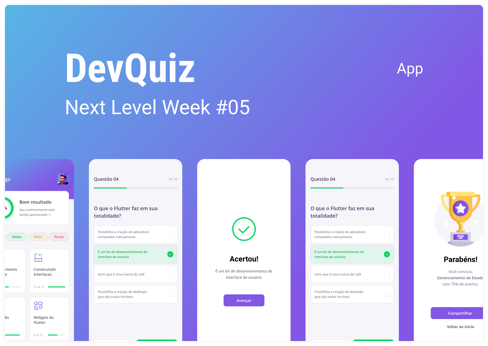

<h1 align="center">
  
</h1>

<p align="center">
  

 
</p>

<br>

<p align="center">
  
</p>

<h2 align="center">Arquivos no Notion</h2>

- [Trilha Flutter](https://www.notion.so/Trilha-Flutter-a306b8d8751b4f76a7a1fc8f29db6d65) 

---

<h2 align="center">Layout</h2>

   <p align="center">
      Layout utilizado para o desenvolvimento, você pode acessá-lo no FIGMA:
   
   - <a href="https://www.figma.com/file/XaC3pgD1B0iLSWLTsUqxIe/DevQuiz-(Copy)?node-id=0%3A1">Mobile</a> 
   </p>

---

<h2 align="center">Funcionalidades</h2>

   <p>
   
- Quiz: 
    - Perguntas
    - Respostas
    - Feedback para o usuário
    - Ranking e Score
    - Resultados
    - Compartilhamento de Resultados

   </p>

---

<h2 align="center">Como Usar</h2>

   <p align="center">
     Em primeiro lugar, configure corretamente o ambiente de desenvolvimento Flutter em sua máquina, para isso acesse o link abaixo:
   - <a href="https://flutter.dev/docs/get-started/install">Flutter Install</a>   
   </p>

   ```     
   - Clone este repositório:
   $ git clone https://github.com/Guysanches/DevQuiz

   - Entre no diretório:
   $ cd DevQuiz

   - Use o comando para instalar dependências:
   $ flutter pub get

   - Execute o aplicativo: 
   $ flutter run
   ```

---

<h2 align="center">Licença</h2>

<p align="center">
   Este repositório está sob licença MIT. Para mais detalhes acesso o arquivo: <a href="https://github.com/Guysanches/DevQuiz/blob/main/LICENSE">LICENSE</a>. 
</p>


   >Projeto foi desenvolvido na #NextLevelWeek05 da **[Rocketseat](https://rocketseat.com.br/)**.<br>   

---

   <div align="center">

   [](https://www.linkedin.com/in/guilherme-sanches-da-silva-0461b6165)

   </div>